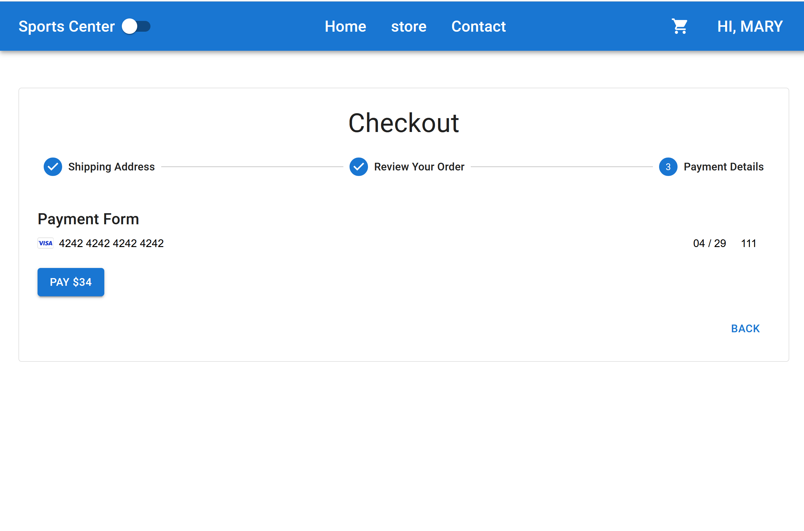

# miniAmazon-SpringBoot-React


## Introduction
This project implements modern development practices using Spring MVC for the back-end and React for the front-end. It features secure user authentication, dynamic data management, and robust application performance by leveraging **Spring Boot, Spring Security, Spring Data JPA, MySQL, Redis, and Redux Toolkit**. The application supports functionalities like user **registration, login, search, sorting, pagination, filtering, and order management**.

## Key Features
**User Registration and Login:** Implements secure user authentication and authorization using Spring Security and JWT.  
  
  
**Product Search, Filtering, Sorting and Pagination:**     
  
**Shopping Basket Management:** Integrates Redis for caching and managing basket items, improving application performance.   
*view cart*    
    
*chekcout*  
  
  
  

*orders management*  
    
**Secure Data Storage:** Utilizes MySQL with Spring Data JPA for reliable and secure data management.
**Front-End with React and Redux:** Uses React and Redux Toolkit to efficiently manage application states and asynchronous actions.  
Responsive User Interface: Styled with Material UI for a modern and user-friendly design.  

## Technologies Used  
### Back-end:  
Spring Boot with Spring MVC  
Spring Security for authentication and JWT  
Spring Data JPA for database interactions  
MySQL for relational data storage  
Redis for caching and shopping basket management  

### Front-end:  
React  
Redux Toolkit for state management  
Thunk API for handling asynchronous actions  
Material UI for styling  

## Running the Application(Docker is needed)  
1. Navigate to the docker folder and run:  
```docker-compose up -d```  
This will start the MySQL and Redis containers, with data initialization   through mounted volumes.  

2. Build the Project in the src folder:    
```mvn clean install```  
Start the Spring Boot Application  

3. Once built, start the backend of the application in the src folder:  
```mvn spring-boot:run```  

4. Then start the front end of the application in the client folder:  
```npm run dev```  
The front-end will be accessible at http://localhost:3000.  

